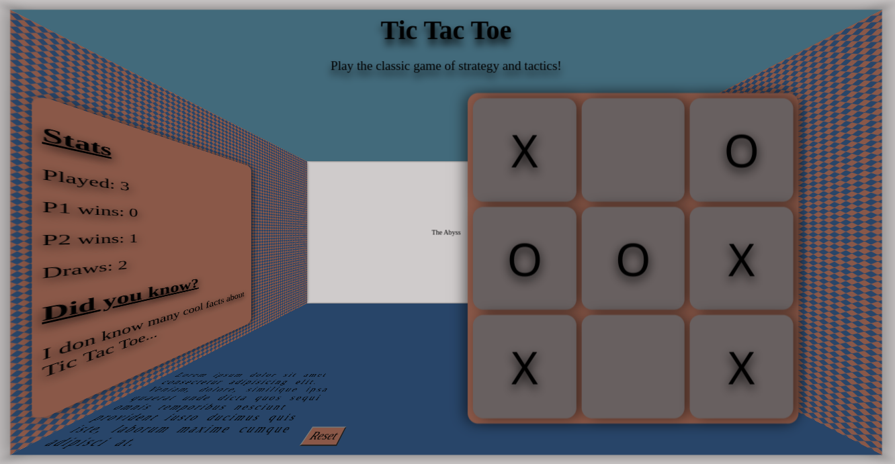

# Tic Tac Toe Game

Welcome to my Tic Tac Toe game project! This project showcases my skills in front-end web development by implementing the classic game of strategy and tactics. I designed and created this game from scratch using HTML, CSS, and JavaScript.

## Live Demo

You can experience the live version of the Tic Tac Toe game by visiting the [demo link](https://nduvhoedward-odinprojects.github.io/Tic_Tac_Toe/).

## Features

- **Interactive Gameplay**: Play the game by clicking on the cells to place your moves.
- **Winning Logic**: The game detects winning patterns and announces the winner.
- **Draw Detection**: If the game ends in a draw, it provides that information as well.
- **Reset**: You can reset the game board to play again.

## Technologies Used

- **HTML**: The game layout and structure are built using HTML5.
- **CSS**: I've styled the game board and components using CSS3.
- **JavaScript**: The game's interactive functionality and logic are implemented using vanilla JavaScript.

## How to Play

1. Open the [live demo](https://nduvhoedward-odinprojects.github.io/Tic_Tac_Toe/).
2. Click on the cells of the game board to make your moves (alternating between 'X' and 'O').
3. The game will announce the winner if a winning pattern is detected or indicate a draw if the board is full.

## Acknowledgments

- This Tic Tac Toe game is a project completed as part of my learning journey with TheOdinProject.
- Special thanks to TheOdinProject community and mentors for their guidance and support throughout the project.

Feel free to explore the code in this repository to see how the game mechanics are implemented and styled. I hope you enjoy playing this classic game!

# Tic Tac Toe Game

Welcome to my Tic Tac Toe game project! This project showcases my skills in front-end web development by implementing the classic game of strategy and tactics. I designed and created this game from scratch using HTML, CSS, and JavaScript.

## Live Demo

You can experience the live version of the Tic Tac Toe game by visiting the [demo link](https://nduvhoedward-odinprojects.github.io/Tic_Tac_Toe/).

## Features

- **Interactive Gameplay**: Play the game by clicking on the cells to place your moves.
- **Winning Logic**: The game detects winning patterns and announces the winner.
- **Draw Detection**: If the game ends in a draw, it provides that information as well.
- **Reset**: You can reset the game board to play again.

## Technologies Used

- **HTML**: The game layout and structure are built using HTML5.
- **CSS**: I've styled the game board and components using CSS3.
- **JavaScript**: The game's interactive functionality and logic are implemented using vanilla JavaScript.

## How to Play

1. Open the [live demo](https://nduvhoedward-odinprojects.github.io/Tic_Tac_Toe/).
2. Click on the cells of the game board to make your moves (alternating between 'X' and 'O').
3. The game will announce the winner if a winning pattern is detected or indicate a draw if the board is full.

## Acknowledgments

- This Tic Tac Toe game is a project completed as part of my learning journey with TheOdinProject.

Feel free to explore the code in this repository to see how the game mechanics are implemented and styled. I hope you enjoy playing this classic game!

